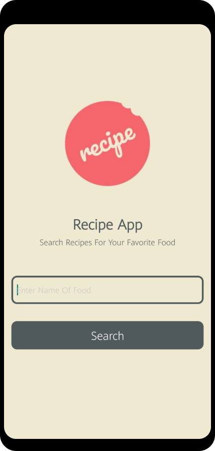
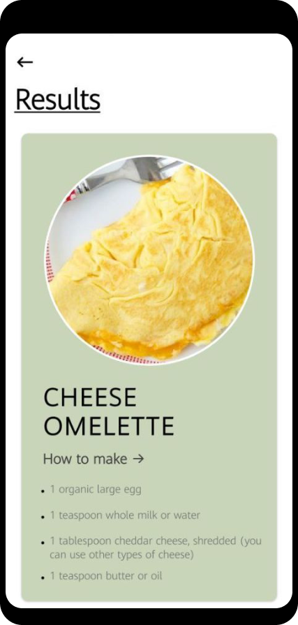
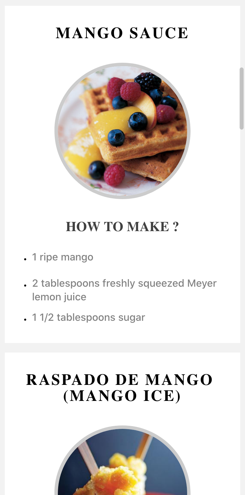

# Recipe-React-Native

  
  
  

## Overview

Recipe is an application built using React Native! Since its developed in React Native, it can be installed on both Android and iOS. The user is required to enter a food item and the app seraches for 10 different dishes that can be made using the food item entered. The app incorporates:

- React Native
- React Native Navigation
- API from Edamam
- Javascript and JSX

## Getting Started

> This app is not available on the App Store/ Play Store.

### Prerequisites

- Expo Client for mobile phones

### Installation

1. Clone or download the project to your local machine
2. To check out the project on windows/ mac, just run npm run web.
